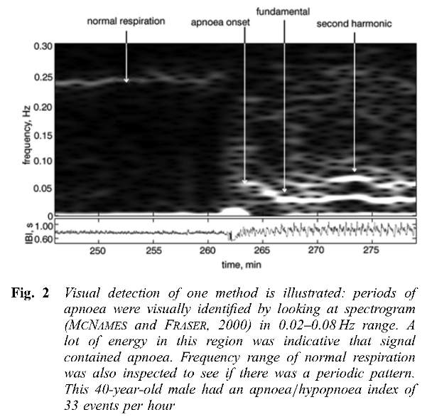
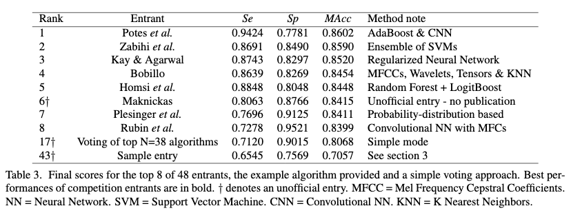

About me
========

[{height="90px"}](https://louisabraham.github.io/)

Louis Abraham
-------------

-   Education: École polytechnique, ETH Zurich

-   Experience:

    -   Quant @ BNP Paribas

    -   Deep learning @ EHESS / ENS Ulm

    -   Data protection @ Qwant Care

Non-exhaustive list of current and potential AI applications in medicine
========================================================================

-   Basic biomedical research
    -   Automated experiments
    -   Automated data collection
    -   Gene function annotation
    -   Prediction of transcription factor binding sites
    -   Simulation of molecular dynamics
    -   Literature mining

Non-exhaustive list of current and potential AI applications in medicine
========================================================================

-   Translational research
    -   Biomarker discovery
    -   Drug--target prioritization
    -   Drug discovery
    -   Drug repurposing
    -   Prediction of chemical toxicity
    -   Genetic variant annotation

Non-exhaustive list of current and potential AI applications in medicine
========================================================================

-   Clinical practice
    -   Disease diagnosis
    -   Interpretation of patient genomes
    -   Treatment selection
    -   Automated surgery
    -   Patient monitoring
    -   Patient risk stratification for primary prevention

The success of automated medical-image diagnosis
================================================

-   Radiology
    -   detection of lung nodules using computed tomography images
    -   diagnosis of pulmonary tuberculosis and common lung diseases
        with chest radiography
    -   breast-mass identification using mammography scan
-   Dermatology
    -   dermatologist-level accuracy in diagnosing skin malignancy
        trained on 129,450 clinical images
-   Ophthalmology
    -   expert level in referable diabetic retinopathy and diabetic
        macular oedema identification trained using 128,175 retinal
        images
-   Pathology
    -   detection of prostate cancer from biopsy specimens
    -   identification of breast cancer metastasis in lymph nodes
    -   detection of mitosis in breast cancer
    -   net deficit of more than 5,700 full-time equivalent pathologists
        by 2030

Other domains
=============

-   Genome interpretation

    -   Deep learning outperforms conventional methods

-   Biomarker discovery

A few examples from the PhysioNet challenge
===========================================

-   clinical databases

-   library of publications

-   software

-   challenge

PhysioNet 2000: Detecting and quantifying apnea based on the ECG
================================================================

[@goldberger2000physiobank]

-   70 recordings of ECG signal digitized at 100 Hz with 12-bit
    resolution, continuously for approximately 8 hours split in training
    and test dataset

-   1 label per minute

-   2 tasks: detection per patient and detection per minute

-   results: 100% and 90% accuracy

PhysioNet 2000: Detecting and quantifying apnea based on the ECG
================================================================

{height="300px"}

PhysioNet 2004: Spontaneous Termination of Atrial Fibrillation
==============================================================

[@moody2004spontaneous]

-   Is it possible to predict if (or when) an episode of atrial
    fibrillation will end spontaneously?

-   80 one-minute recordings of two simultaneously recorded ECG signals

-   3 classes

    -   N: non-terminating AF
    -   S: terminates one minute after the end of the record
    -   T: terminates immediately after the end of the record

-   Training 10N+10S+10T, Test A 15N+15T, Test B 10S+10T

-   results: 97% and 100% accuracy

-   similar method: simple signal processing

PhysioNet 2016: Classification of Normal/Abnormal Heart Sound Recordings
========================================================================

[@liu2016open]

-   4,430 recordings taken from 1,072 subjects, totalling 233,512 heart
    sounds

-   Additional data: subject demographics (age and gender), recording
    information, synchronously recorded signals (such as ECG), sampling
    frequency and sensor type used

-   3 labels: Normal, AF, Noisy

-   2 metrics: **Se**nsitivity (detecting abnormal) and **Sp**ecificity
    (detecting normal)

PhysioNet 2016: Classification of Normal/Abnormal Heart Sound Recordings
========================================================================

{height="300px"}

PhysioNet 2018: You Snooze, You Win
===================================

[@ghassemi2018you]

-   1,983 polysomnographic recordings

-   Clinical features and 13 signals

-   detect arousals

PhysioNet 2018: You Snooze, You Win
===================================

{height="300px"}

Conclusion
==========

-   Older systems are still not widely used

-   Increase in dataset sizes

-   AI is meant to complement, not replace doctors

References {#references .allowframebreaks}
==========
